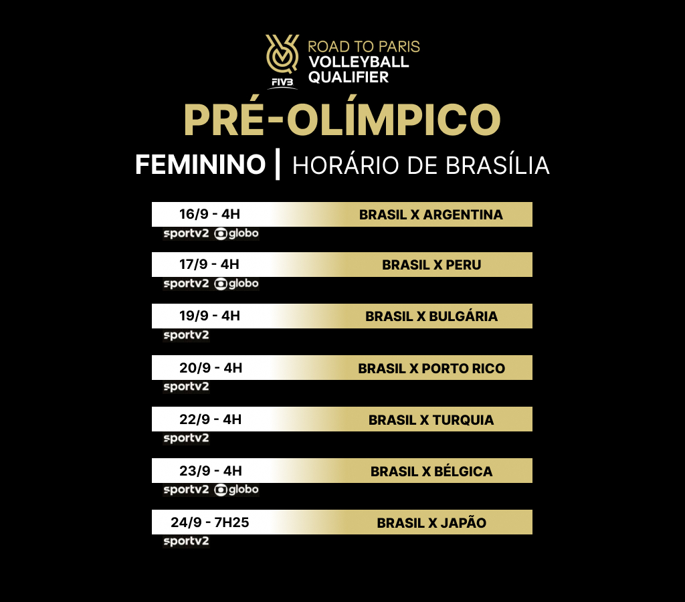

<h1 align="center"> Volleyball Qualifier </h1>

Projeto desenvolvido para praticar a base do desenvolvimento web

  <a href="#-tecnologias">Tecnologias</a>&nbsp;&nbsp;&nbsp;|&nbsp;&nbsp;&nbsp;
  <a href="#-projeto">Projeto</a>&nbsp;&nbsp;&nbsp;|&nbsp;&nbsp;&nbsp;
  <a href="#-layout">Layout</a>&nbsp;&nbsp;&nbsp;|&nbsp;&nbsp;&nbsp;
  <a href="#memo-licença">Licença</a>

  

 

  

## 🚀 Tecnologias

Esse projeto foi desenvolvido com as seguintes tecnologias:

- HTML 
- CSS
- JavaScript

## 💻 Projeto

Calendário de jogos do pré-olímpico da seleção brasileira de vôlei feminino.

## 🔖 Layout

Você pode visualizar o layout do projeto através [DESSE LINK](https://www.figma.com/file/azCng6iFX9cLhLLbe15Idr/Volleyball-Qualifier?type=design&node-id=0%3A1&mode=design&t=XX3513hpLYlgZacn-1). É necessário ter conta no [Figma](https://figma.com) para acessá-lo.

## :memo: Licença

Esse projeto está sob a licença MIT.

---

Feito e desenvolvido por [Isa Kaillany](https://github.com/IsaKaillany)